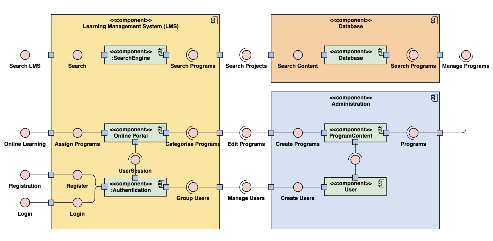

<!-- START doctoc generated TOC please keep comment here to allow auto update -->
<!-- DON'T EDIT THIS SECTION, INSTEAD RE-RUN doctoc TO UPDATE -->


- [Overview](#overview)
  - [Who is behind this?](#who-is-behind-this)
  - [What is in this README?](#what-is-in-this-readme)
- [Instructions](#instructions)
  - [Set up](#set-up)
  - [Configuration](#configuration)
  - [Deployment](#deployment)
    - [Frontend Client](#frontend-client)
    - [Backend Server](#backend-server)
  - [Troubleshooting](#troubleshooting)
  - [Related links](#related-links)
- [Application information](#application-information)
  - [Purpose of application](#purpose-of-application)
    - [Problem description](#problem-description)
      - [Problem 1](#problem-1)
      - [Problem 2](#problem-2)
      - [Problem 3](#problem-3)
    - [Solution proposed](#solution-proposed)
  - [Functionality & features](#functionality--features)
  - [Tech stack](#tech-stack)
    - [Front-end](#front-end)
    - [Back-end](#back-end)
    - [Database](#database)
    - [Deployment](#deployment-1)
    - [Architecture](#architecture)
    - [Code style](#code-style)
- [Design process](#design-process)
  - [Source control process](#source-control-process)
  - [Project management](#project-management)
    - [Trello](#trello)
    - [Estimating timings](#estimating-timings)
    - [Agile Epics](#agile-epics)
  - [Testing](#testing)
    - [Unit testing](#unit-testing)
    - [Integration testing](#integration-testing)
    - [E2E testing](#e2e-testing)
    - [Usability testing](#usability-testing)
- [User Stories](#user-stories)
  - [Learner](#learner)
  - [Revision of Learner User stories](#revision-of-learner-user-stories)
    - [Login and Sign up](#login-and-sign-up)
    - [Search functionality](#search-functionality)
    - [Emoticon use in buttons](#emoticon-use-in-buttons)
  - [Manager](#manager)
  - [Revision of Manager User stories](#revision-of-manager-user-stories)
    - [Analytics page](#analytics-page)
    - [Other revisions](#other-revisions)
  - [Admin](#admin)
  - [Revision of Admin User stories](#revision-of-admin-user-stories)
    - [Hamburger menu](#hamburger-menu)
    - [Other revisions](#other-revisions-1)
- [Workflow diagrams](#workflow-diagrams)
  - [Learners](#learners)
  - [Managers](#managers)
  - [Admins](#admins)
- [Wireframes](#wireframes)
  - [Lo-fi wireframes](#lo-fi-wireframes)
    - [Desktop views](#desktop-views)
    - [Mobile views](#mobile-views)
  - [Hi-fi wireframes](#hi-fi-wireframes)
    - [Desktop views](#desktop-views-1)
    - [Mobile views](#mobile-views-1)
- [Database ERD](#database-erd)
- [Data flow diagram](#data-flow-diagram)
- [OO Design documentation](#oo-design-documentation)
  - [UML—Component diagram](#umlcomponent-diagram)
  - [UML—Use case diagram](#umluse-case-diagram)
- [Project plan and timeline](#project-plan-and-timeline)
- [Client communications](#client-communications)
- [Short Answer Questions](#short-answer-questions)
  - [a) What are the most important aspects of quality software?](#a-what-are-the-most-important-aspects-of-quality-software)
  - [b) What libraries are being used in the app and why?](#b-what-libraries-are-being-used-in-the-app-and-why)
    - [React](#react)
    - [Joi](#joi)
    - [Express](#express)
    - [Mocha](#mocha)
    - [Jest](#jest)
    - [Sinon?](#sinon)
    - [Supertest](#supertest)
  - [c) A team is about to engage in a project, developing a website for a small business. What knowledge and skills would they need in order to develop the project?](#c-a-team-is-about-to-engage-in-a-project-developing-a-website-for-a-small-business-what-knowledge-and-skills-would-they-need-in-order-to-develop-the-project)
    - [User requirements](#user-requirements)
    - [Future plans for website](#future-plans-for-website)
    - [User experience (UX)](#user-experience-ux)
  - [d) Within your own project what knowledge or skills were required to complete your project, and overcome challenges?](#d-within-your-own-project-what-knowledge-or-skills-were-required-to-complete-your-project-and-overcome-challenges)
    - [Technical skills](#technical-skills)
    - [Domain knowledge](#domain-knowledge)
    - [Interpersonal skills](#interpersonal-skills)
  - [e) Evaluate how effective your knowledge and skills were this project, using examples, and suggest changes or improvements for future projects of a similar nature?](#e-evaluate-how-effective-your-knowledge-and-skills-were-this-project-using-examples-and-suggest-changes-or-improvements-for-future-projects-of-a-similar-nature)
    - [Evaluation of effectiveness](#evaluation-of-effectiveness)
    - [Future suggestions for improvement](#future-suggestions-for-improvement)
- [Presentation](#presentation)
  - [Slide deck](#slide-deck)
- [Close of project](#close-of-project)

<!-- END doctoc generated TOC please keep comment here to allow auto update -->

# Overview

This README file is for a Learning Management System (LMS) app for client, MI Academy, built by three Coder Academy students using MERN stack. All related files and more information are below.

## Who is behind this?
These legends 👇🏽

Gwenny Warnick (left), Josh Teperman (middle), David Bui (right)


## What is in this README?
There is an overview of the planning and build details of a real-world MERN app for Coder Academy built for a final course assesment. There are also questions answered as part of the assessment task.

# Instructions

A live version of this application can be found at https://mi-academy.netlify.com/.


## Set up 
To run this application locally on your computer, complete the following steps.

### Downloading the code:
To download the code to your computer, navigate to the directory you want to use on your computer and install both repositories. You'll need to run the following code from the root of your directory: <br>
Backend: `git clone https://github.com/JoshTeperman/mern-project-backend.git` <br>
Frontend: `git clone https://github.com/JoshTeperman/mern-project-backend.git` 

You should now have a folder structure that looks like this:

Root Directory\
-mern-project-backend/\
-mern-project-frontend/

Alternatively, you can download the code directly to your hard-drive: \
https://github.com/JoshTeperman/mern-project-backend/archive/master.zip\
https://github.com/JoshTeperman/mern-project-frontend/archive/master.zip


### Back End Setup:
To run the back end server, you will need to have Node.js installed on your machine. You can install Node at one of these websites: \
https://docs.npmjs.com/downloading-and-installing-node-js-and-npm\
https://nodejs.org/en/download/\
... or if you have Homebrew installed run `brew install node` from console. 

Once you have Node installed, navigate into your backend directory `cd mern-project-backend` and run `npm install` to install the project dependencies. 

Next, create a new file named `.env` in your root directory and add the following, replacing the brackets `{}` with your own values:

DB_URL=mongodb://localhost:27017/{database name} <br>
JWT_SECRET={secret key} <br>
seedPassword={seed password}

`DB_URL` Should be the name you want to call your database. `JWT_SECRET` and `seedPassword` can be any random string.

Next, run `mongod` in terminal to initialize the the MongoDB database. This will create a new database and run it locally on your machine. 

You can now run `npm start` to run the express server and connect to the development database. If successful, you shold see the following logs in console:

``` 
listening on PORT 5000
✅  Connected to MongoDB
```

### Front End Setup:
Follow the same steps to install the front end dependencies:

Navigate to the front end directory:

`cd mern-project-front-end`<br>

Install front end dependencies:

`npm install`

Start the front-end server:

`npm start`

You will see the server load in terminal, and if there are no errors you will be able to navigate to `http://localhost:3000/` in your web browser to view a live version of the website. 

## Configuration for local deployment

### Seeding 
To get the application working on your local machine you will need to seed data in the database. To use the seeds provided, you will need to make HTTP POST requests to the seed endpoints using your preferred HTTP client (Postman is a popular example: https://www.getpostman.com/downloads/)

Authorization is required to seed the database. To do this, send POST requests authorized with the seedPassword in the header:

 `key: 'password', 'value: '{your seedPassword}'` 

On your local machine, you should be able to make a POST request to:
http://localhost:5000/admin/seed

For deployment to MongoDB Atlas and other service providers, the following POST endpoints are provided if you run into Timeout issues. These endpoints should be hit in the following order:

1) http://localhost:5000/admin/seed/clients
2) http://localhost:5000/admin/seed/programs
3) http://localhost:5000/admin/seed/projects
4) http://localhost:5000/admin/seed/resources
5) http://localhost:5000/admin/seed/users

## Deployment

To deploy, we used the following distributed set up for the front and back end of the app. 

### Frontend Client

>Netlify

Netlify allows for free, continuous deployment integrated with Github, so we used it for the client side of the app. Their content delivery network allows for fast deployment as well. 

### Backend Server

>Now

For server-side of the application, we deployed using now.sh, which allows us to control environmental variables in a now.json file. Being designed with Developer Experience (DX) in mind, we also felt it was a good choice since a developer would likely be doing further work on the site in future after handover. 


## Related links

As part of the project, we used the following resources, accessible at their links. 
> Trello https://trello.com/invite/b/nv1QDYPb/f77e98d472c980ba113a05329a62b1e4/mern-app-dream-team

>Github Repository (Front end of app) https://github.com/JoshTeperman/mern-project-frontend

>Github Repository (Back end of app) https://github.com/JoshTeperman/mern-project-backend

# Application information
The client, MI Academy, is an award-winning Melbourne start-up specialising in customised training solutions on marketing, CX, UX and innovation. 

*MI Academy website*


*Examples of MI Academy training programs*


*Areas that MI Academy specialise in*


We liaised predominantly with the managing director of MI Academy, Alita Harvey-Rodriguez, a respected thought leader and speaker in her field. 


## Purpose of application
MI Academy wanted a learning portal, or Learning Management System (LMS) for their clients. The main purpose of the app is to provide MI Academy clients with one place they can go to access
- year-long MI Academy Program information
- quarterly MI Academy Project information
- content items that form each project.

The design of the LMS was to be in line with the MI Academy brand and tone of voice, as per the branding guide and tone of voice guide shown below. 

*MI Academy Brand guide—screenshot*


We kept all project materials aligned to the brand and kept in mind the MI Academy vision to be world-class in terms of UX. 

*MI Academy vision*


We also designed with consideration of the MI Academy personality—to be clear, concise and fun. The extracts below show the relevant parts from the MI Academy Tone of Voice documentation.

*MI Academy Tone of voice extracts—personality and approach to language*


### Problem description
MI Academy do face-to-face training with their clients over the course of one year. This is referred to as a Program and is aligned with each client's specific business goals. In a program, there are typically four quarterly projects that aim to help clients progress further towards their business goals. 

#### Problem 1
MI Academy has a problem with clients staying on track with the content they cover in face-to-face training after each workshop. Workshops usually happen once during the three-month period of a project, and during the rest of the time, clients may
- lose resources like handouts or links 
- forget the business goals they're working towards
- lose track of the activities they should be doing.

#### Problem 2
There is also a problem with clients not having their content in one place. For example, programs include a combination of videos, handouts, links, recordings and spreadsheets.

#### Problem 3
Finally, MI Academy would like to be best practice in terms of training. This would require them to have learning activities and assessment of some kind to
- help clients stay focussed on their quarterly project goals
 - provide evidence of clients having learned the content successfully.

### Solution proposed

We proposed an LMS as a solution that could deal with all of these problems. An LMS will allow MI Academy to 
- keep content in one place for clients
- facilitate clients revising content they learn in workshops
- measure and report on their clients' progress in terms of content covered.

## Functionality & features

The Minimum Viable Product (MVP) for the project was clarified early on in the project as per the slides below. MVP included three logins for
- admin
- manager
- learner.

*Screenshot of slide used to clarify MVP during client meeeting*


The app's core functionalities were for users to be able to 
- log in
- click a 'Forgot password' link
- edit profile
- view programs, projects and content
- mark course content as complete.

*Screenshot of core functionality in user flow as presented to client*


'Nice-to-haves' were the ability for
- all users to submit a support ticket request
- managers to see 
  - their team members (a group of learners)
  - each team member's progress in terms of completed content
  - the collective progress of the team e.g. 78% complete for a project.

## Architecture

Our software is separated into two main sections and broadly follows separation of concerns and an MVC model. 

### Backend: Model (M) and Controller (C) 
- Node.js API / server written with the Express.js module that routes Client HTTP requests, interacts with the database, handles data & model validation, stores and manages private keys and passwords, encrypts and decrypts user passwords and user tokens, and provides routing and other business logic.
- Locally run instance of MongoDB Database for Development with a MongoDB Atlas cloud-based Database for Production. 

### Frontend: View (V)
- React.js Client UI, which provides front-end pages and routes, interacts with the backend API, retreives and stores user authentication tokens, tracks current user information and manages User Interface and display.

## Tech stack
We used the MERN Stack as the core of our application. The full list of languages & Frameworks used is:
- MongoDB database with Joi library for Model validation
- Express.js and Node.js server
- Bcrypt and JSON Webtokens for user authentication and authorization
- HTML, CSS & React.js with BrowserRouter for front-end UI and Client-side logic
- Jest, Mocha, Enzyme, Chai, and Supertest for testing
- now.sh used with Netlify for deployment

### Code style

The intention with this application was to keep it as simple as possible, keeping in mind usablility, readability, and extensibility with solid documentation so that future development would not rely on the current team.

#### Application Usability
- We wanted the UI to be very simple, intuitive, and fast for the user.
- We wanted to minimize the amount of 'clicks' required to navigate the app
- We wanted relavent information to be immediately available and not hidden inside menus
- We wanted to the UI to display personalized information to the user, including greeting the user by name and showing their own program information and progress
- We wanted to minimize the number of database calls and cache information where possible to provide a seamless, lightning-fast user experience


#### Code Readability & Extensibility
- We followed DRY principles as much as possible. Repeated and shared code has been extracted into functions, for example there are multiple methods that create a User in the database, therefore this code has been turned into its own method. 
- We modularized our code as much as possible and created a folder structure to make the code easy to navigate. It should be relatively simple to understand this structure to someone coming to the code for the first time, or ourselves in six months time. 
- Frontend code contains folders for each component, their styles and tests
- Backend code has extracted the logic for the Server / Express App, config, routes, controllers & business logic, utility methods and tests
- We have provided tests for happy path as well as a number of unhappy path tests for backend that confirm authorization, routes, and model validations are working as expected. 
- Tests and file structure should provide future development teams with confidence should they decide to refactor or extend the application.
- We have attempted to be logical and declarative with directory, file, variable and method naming 

# Design process

## Source control process

Github 

We used Git and GitHub to manage source control, versioning and collaboration on our project. 

We set up two separate repositories, for frontend and backend code, with all members set up as collaborators. 

We created and agreed upon rules of conduct to ensure proper version control, avoid bugs and merge conflicts, enforce proper 
reviews and therefore try to maximise code quality and productivity. 

1. Each member of the team would have administrator access to the repositories, but would only push from their own branches, never from master.
2. Code review is required but at least one member of the team for a pull request to be merged with the master branch. This can be overidden with Administrator priveleges but was highly discouraged. 
3. Only branches that are up-to-date with master can be merged.
4. We decided that given the limited feature complexity of our product initially, it wasn't necessary to use feature branches, although we did in some cases.

> Screenshot of GitHub rules created for our repositories:


> Screenshot of feature branch and other branch activity:


## Project management

We used Agile methodology throughout, following the Kanban approach.

### Trello 
A trello board was set up at the beginning of the project with the following columns for project management according to Kanban
- Ready to do (backlog)
- Doing
- Done.

As we developed Epics, User stories and estimated Story points, we recorded details on the Trello board. We revised before lunch and at the end of the day, making more cards if needed to move tasks from one day to the next if not all were completed. 

### Estimating timings

We estimated times in terms of days (e.g. half a day or 2 days' work). Then we added deadlines to cards, as shown below. 

*Trello board, Day 1*

*Trello board, end of Week 1*

*Trello borad, end of Week 2*


We also kept documents we would need to refer to again here, including
- MI Academy documents (e.g. branding guide, logos)
- Rubric for Coder Academy assessment
- README requirements.

### Agile Epics

We fleshed out Epic value statements for each of our user types. This helped with planning and estimating story points when we went to individual user stories and their related functionality. 

*Epic value statements*


We added non-functional requirements under learners as well at this stage. We thought this non-functional requirement was enough to note, as it would ensure the design of the app supported all users being able to access their information conveniently. 

Note: refer to Excellent use of task delegation with Kanban board of tickets assigned to team members labelled with *difficulty level* and corresponding Git commits

## Testing 

Note: Tie to user stories 
Rubric: Flawless code flow control: documented test coverage/successful results for all user stories, including corner cases

### Unit testing
We did unit tests for functions and components in the Learner and Manager user stories, which were the user stories that made up MVP.


### Integration testing


### E2E testing

### Usability testing

Due to the time frame, we user tested primarily using each other's devices. Below are screenshots of the login page on three different devices—iPhone 6, Android, MacBook Pro. Using our devices allowed us to test out the usability as well as notice gaps in code, for example the submit button missing in the iPhone view below. 

*iPhone 6 view*


*Android view*


*Macbook Pro view*


# User Stories

We wrote user stories to help us plan and prioritise the development of the app's features. As is standard for Agile user stories, we formulated stories with the structure 'As a user I want to do x so I can y.'

## Learner 

> As a learner I want to...
1. login & register an account using my own email address so that my experience is personalised
2. view a dashboard that contains all of my training program information so that I can review what I have learned and what to study next
3. filter & sort courses in the dashboard, so that I can view the most relevant. Details include:
    - unfinished courses
    - completed courses
    - course progress (percentage, num modules)
    - course start date / due date / completed date
    - recent courses
4. view my Profile page and personalize my profile information so that I can have fun
5. view my Account information, which may include payment history and invoices if I have the relevant authorization and if MI Academy is enrolling students for paid courses in future
6. click on a course tile and view a course page, where I can watch videos, read materials, and navigate between modules of the course.

## Revision of Learner User stories

### Login and Sign up
For the first user story, we ended up only including 'Login' and not Sign up (see wireframe below). This was because after talking to the client about how their programs work, we understood that the register functionality is not required with the way their programs are currently set up. This also meant we removed payment information from our workflow. 

*Early wireframe design with Login and Sign up*


*Login screen, after revision*


### Search functionality
Search was designed but the functionality was clearly outside our MVP after two weeks. Therefore, we revised this user story and removed it from scope in the MVP. It will be in future iterations. 

*Search design for mobile device*


### Emoticon use in buttons

One of the ideas we played with in wireframes was using emoticons as arrows on buttons. We thought this reflected the 'fun' part of the brand personality that MI Academy have and it was in line with the resources they already have designed, such as workshop slide decks. 

*Extracts from MI Academy slide deck*


*Experimenting with emoticons on buttons*


MI Academy loved this feature and requested that it be continued throughout the app design where possible. They liked the pointing finger emoticon best, so we used this on buttons throughout the app's navigation. 

The rest of the User stories for Learners were implemented in the first iteration of the app as described.

## Manager  

>As a manager / supervisor I want to...

1. view an analytics page with overall progress for training programs so that I can support my team better, including completion statistics, progress, grades
2. print and export data so that I can use it as a performance management tool
3. manage / view subscription & payment details so that I can be aware of my course history.

## Revision of Manager User stories

### Analytics page

The analytics page from the first User story was designed in the early stages of the project. The client wanted it gamified, and we knew this would require a longer time period, so it was removed from MVP, but the user story evolved during the project planning stages from progress or analytics to the landing page for a manager showing team progress (collective progress of all team members) then a 'Your team' screen which would have individual analytics. The images below show this evolution. 

*Early design of how team progress might look on manager landing page*


*Later design showing progress bar and 'Your team' for Manager analytics*


### Other revisions

The second User story was outside of scope for the first iteration of the app. The payment User story was removed from the planning since it was not required by the client. 

## Admin
>As an MI employee (admin) I want to...

1. publish & manage training programs through the administrator dashboard, so that I can flexibly manage and update course options, prices, and content
2. view an overhead view of all ongoing programs and their details so that I can track learner progress
3. view reporting & analytics for any program.

## Revision of Admin User stories

### Hamburger menu

We initally designed for a hamburger menu for Admin, thinking we might need more pages to be able to design for the Admin User stories. During consultation with the client, we agreed that the Admin would be primarily desktop and the hamburger menu wasn't necessary for our app's functionality. 

*Hamburger menu design for Admin*


### Other revisions 
For Admin, payment was removed from the User story as with the other two user types. The second and third User stories relating to learner progress was considered outside of scope of the MVP. There was a search functionality added, as the client wanted there to be the possibility to search programs and potentially reuse them. 

We designed for this User story (see image below) but it was also outside of scope. 

*Design for Admin search view*


# Workflow diagrams

We created workflow diagrams for the three types of users.
## Learners

At the beginning of the planning, we expected that the Learner (i.e. employee) would need to be able to do the following as depicted in the workflow digram pictured. 

A Learner can

- log in to their personal account
- view and edit their profile
- submit a support ticket request if they need help
- mark program content as completed.

*Learner workflow diagram*


Although Sign Up and Purchasing were functionalities that are not required with the current model MI Academy use, we considered it for future use of the app. 

## Managers

A manager sits in between the app's Admin level and Learner level. This User account is for a person supervising a number of learners, for example, a team leader or a CEO with a marketing or CX team. MI Academy has a number of clients like this. 

For a manager, the functionality is the same as for a Learner, but they can also see progress of all Learners in their team. This is the only main difference. 

*Manager workflow diagram*


## Admins

As per the workflow diagram below, Admin for the app can 
- create, edit and delete programs containing projects
- upload content for projects
- assign projects to a User's program
- assign programs to a User
- assign a manager to a team of Users.

*Admin workflow diagram*


# Wireframes

At the begininning of the project, we designed wireframes for desktop view for the User views. Screenshots of these are below. 

## Lo-fi wireframes 

We designed lo-fi wireframes to start with before meeting with the client so that we had a tool for discussions. Since we had branding and colour themes from the client already, we did the views we expected to be using with some colour when we were ahead of time. 

### Desktop views


We designed lo-fi mobile views after meeting with the client and discovering they would like responsive mobile-first design for the user and manager interfaces.

### Mobile views

*Login page design and Sign up design (latter not required for MVP)*


*Payment pages (not required for MVP) and Project & Content page views*


*Hi-fi hamburger menu and analytics design—not included in later designs as not required for MVP*


*Hi-fi Landing page and Edit profile designs*


## Hi-fi wireframes

Initially, we completed designs for desktop views. These were approved by the client. 

### Desktop views

*Hi-fi login page designs*


*Hi-fi Program and Edit Profile page designs*


*Hi-fi Support request and Content page designs*


### Mobile views

After meeting with our client, MI Academy wanted the responsive design to be mobile-first to suit the needs of their clients. 

We obtained the Google analytics data for their website (see screenshot below), and more people accessing the site were on desktop; however, for the purpose of the LMS, the client expected people to need to access the content on their mobiles, for example while commuting.

*Screenshot of Google Analytics data on device type*


We completed hi-fi designs in Figma with a working prototype user flow. 

*Mobile user flow*


For managers, two extra views were required (shown below)
- team progress overview
- your team (showing the learners in that manager's team).

*Hi-fi manager views*


# Database ERD

There are three levels of data for the LMS content in the app, which consist of
- programs (one year long containing four projects)
- projects (each containing content items)
- resources (e.g. learning activities, videos, worksheets).

Resources and projects are dependendent on Programs and users are all assigned programs. A client is a company which may consist of one user, or Learner ('employee' in the ERD), or a team, which has a Manager and one or more Learners (all 'employees' in the ERD associated with a client). 

*Entity Relationship Diagram*


# Data flow diagram
Data in the app can be categorised into four main groups, which include
- user profile data
- program info (containing goals, description, and projects)
- project info (containing goals, description and content items)
- content items (i.e. resources such as learning activities, videos, quizzes).

Admin create and edit all of these data whereas Learners and Managers can only view them in the UI, with the exception of a User profile, which all users can edit themselves. When a User updates their profile, the database will reflect this change. This process was at the request of the client, who wanted to ensure that learners could access all of their content and account information even if they left the employer they were with at the time of the account creation.

The data flow diagram below offers an overview of the main data flow processes used in the app. 

*Data flow diagram*


# OO Design documentation

## UML—Component diagram 
As shown in the Component diagram below (created using https://online.visual-paradigm.com), the LMS is comprised of 
- database, which stores User data
- administrative functions, which are done via the UI
- the LMS or Online Portal, where users complete learning tasks
- search functionality.

These were the components required to meet the needs of the client, who requested for users to be able to
- search the LMS
- login after being assigned an account by MI Academy
- be assigned programs with content delegated by MI Academy.

Programs are created via the UI and stored in the app's database, as are user profiles. MI Academy needs to be able to search all programs to potentially re-use it. Although this was outside of MVP, we included it in our planning stage. 

*Component diagram*




## UML—Use case diagram

We created a Use case diagram using Creately.com. This displays at a high level the main actors in the context of the app (Admin, Manager, Learner) and the main events in the system.

*Use case diagram*


Instructions from CA: Provide Object Oriented design diagrams (UML or alternative) that clearly identify OO class attributes, methods, relationships.

# Project plan and timeline


# Client communications

At the beginning of the project, we communicated with the client via text message and phone call. We also shared a slide deck for our first two meetings for clearer communication (shown below). The slides acted as our meeting notes record for decisions and next steps. In the first meeting, we gave an overview of our planning steps and began to clarify the MVP. In the second meeting, we clarified the MVP completely and went over User Persoas.

*Slide deck for meeting 1 with MI Academy*


*Slide deck for meeting 2 with MI Academy*


The client was happy with the communication and the quality of the slide deck, as per the text below. 

*Screenshot of text message from client*


The client was also happy to communicate on Microsoft Teams, which allowed us to easily send files or screenshots for approval. The screenshot underneath the slides below shows evidence of this from when User Personas were sent.

*Screenshot from Microsoft Teams client communication*


# Short Answer Questions

As part of the assessment instructions, we are required to answer five short answer questions about software and app design. Our responses to each are listed below the relevant question. 

## a) What are the most important aspects of quality software?

Software Quality Assurance (SQA) is a field in its own right now, incorporating all processes that occur during software development from the beginning until production stages. Its main purpose is to ensure quality. 

According to Software Testing Help, quality can be defined as 'meeting the requirement, expectation, and needs of the customer ... free from the defects, lacks and substantial variants'. In our context, the requirements, expectations and needs come from our client and quality can be measured against these and also against standards from external bodies, such as the international set of standards, ISO/IEC/IEEE 29119 Software Testing.

*Software Quality Assurance Plan graphic* 


Source: https://www.softwaretestinghelp.com/software-quality-assurance/

While there are numerous criteria listed for the quality of software, we know that today, successful software is developed with a customer-centric focus where human-centred design reigns supreme. Hence, we feel that these following six criteria are the most important.

### User stories committed to and delivered
Software must be designed with its users at the centre. While software design in the past might have been disconnected from its users, today good user experience is vital when the market is competitive and fast-moving. The first part of providing enjoyable user experience can be found in the design thinking Double Diamond—'Design the right thing', as shown below. This starts with User stories. 

    *Double Diamond V2 from Dan Nessler https://uxdesign.cc/how-to-fuck-up-the-design-thinking-process-and-make-it-right-dc2cb7a00dca*
    

- User sentiment
    - The second sentiment from the double diamond, 'Design things right', relies on user feedback. As a result, we believe this is also a key criteria when evaluating the quality of software. After all, what's the point of well-designed software if nobody will use it? 

- Appropriate balance of the 'software trifecta'

  - As the saying goes, software can be fast, cheap and high quality, but cannot be all three. You have to pick two. Appropriate software development takes the requirements of the project into account and finds a balance between Quality, Cost and Development Speed, as represented in the graphic below.

  In our case we were forced to sacrifice some quality to achieve MVP within a limited amount of time.

  *Software trifecta*
  

- Continuous improvement
    - Unless it is able to be used over a reasonable life cycle, software may not be worth the cost in time and energy to develop it. Accordingly, we believe continuous improvement is important because it allows software to remain best practice in terms of design and efficiency and allows design teams to respond to changes in the field as required. 

- Production incidents over time
    - Software might deliver on User stories but be too buggy for people to feel comfortable using. Therefore, production incidents over time, particularly if they recur, are an important metric that seem to be often overlooked. 

- Comprehensive testing
    - Any software application needs a comprehensive suite of tests to ensure code quality over time. Test suites allow for code to be tested before critical deployments to make sure there are no breaking changes, are used to pinpoint the exact location of bugs and failed software, are used to test and prepare for unexpected user behaviour, and are often used as a part of the development process itself (in mathods like Test Driven Development) as a way to enforce code quality. 

## b) What libraries are being used in the app and why?

A number of libraries are used in the app. Outside of any assessment requirements, reasons for their use are summarised in the table below and expanded on in the sections following. 

*Table: Summary of libraries used and reasons for use*

|   Library used:	|   React	    |  Express 	|   Mocha	| Jest |    Joi	| Sinon? | Supertest | 
|---	|---	|---	|---	|---	|--- |--- |---
|   Reasons:	|   uses virtual DOM	|   	cc |   	|   	|   |   |   |
|   	        |   component-based 	|   	|   	|   	|   |   |   |
|   	        |   |	|   	|   	|   	|   |   |   |

### React
For Javascript-based apps, manipulating data in the browser DOM still often creates performance issues. React has attempted to resolve this by using a virtual DOM, which is a DOM stored in memory that allows an algorithm in React to compare the DOMs and calculate the most efficient way to store the changes required. This leads to the shortest possible time needed for read/write and is the primary reason for React's high performance.  

React is also component-based, allowing us to maintain a high level of consistency across the app's views and flexibility with how we choose to structure these views in terms of code file storage.

In addition to being the software choice mandated by the rubric, React was an obvious choice to pair with an Express API backend for this project, as it is fast, flexible, and allows us to easily manage the browser DOM and UI using the tools provided by the React framework, all written in the same (Javascript) software language.

#### Express
Express is a Javascript framework built on top of Node.js that allows us to build a server and/or and API.　In this case the Express server responds to HTTP requests from the React Client, retreives data or manipulates data in the MongoDB Database and serves responses to back to the Client. Express is the most popular option for projects that want to build their own server in Javascript. 


#### Mocha / Chai / Supertest
Mocha is the framework we chose to test our backend API and database. We originally wrote tests in Jest, but found that because Jest was written specifically for React, there are some potential risks associated with using Jest for other frameworks. The MongoDB docs specifically warn against using Jest and suggest Mocha / Chai instead. 

Mocha is a popular testing language for Javascript, and when paired with Chai provides comprehensive unit testing and integration testing. We used this pair to test the behaviour of our Mongoose Models and controller functions. Supertest allowed us to test the behaviour of our API, and we used it to confirm that our endpoints were returning the correct status responses to HTTP requests, and appropriate errors when requests lack the right credentials for authorization.

#### Jest / Enzyme
Jest & Enzyme, like Mocha & Chai, are popular testing frameworks used to test Javascript applications, and were built specifically for testing React applications. They provide the same functionality, with some additional functionality (like Snapshots) that allow testing for React-specific features.

## c) A team is about to engage in a project, developing a website for a small business. What knowledge and skills would they need in order to develop the project?

To develop a website for a small business, a team would need to take into account four main areas: user requirements, future plans for the site, and user experience. 

### User requirements

It's important to understand the wider context that the business is operating in and what is affecting their operations and their customers. ADD IN SPEED/QUALITY/BUDGET TRIANGLE HERE Otherwise, there is a risk that the website would be not fit for purpose. Properly understanding the needs of the website users would mean finding out what pain points the business and/or its customers currently have and identifying which of those issues are 
- the most urgent 
- able to be solved with a website.

### Future plans for website 

Small businesses are often stretched in terms of time and resources, which could affect how the website is maintained or updated in the long term. Whether or not a business has a developer on staff or in their budget impacts the design choices of the website build. For example, where the website is hosted and the programming languages used might look very different for a business owner who understands programming compared with someone with little technical understanding who needs a simple user interface to operate or update their website. Thus, clarifying the long term plan for the website and how it is to be maintained or further developed is important to consider before beginning the development.

### User experience (UX)

UX has become more influential in recent times. 88% of users in one study report they wouldn't return to a site after a bad user experience. 79% of shoppers are less likely to buy from a site with poor user experience. Perhaps most significantly, 75% of users evaluate a company's credibiiity based on its website design. As a result, it's no longer acceptable to design a functioning website without creating a postiive user experience. Three important related areas to consider as part of UX are responsive design, accessibility, and usability. Considering these areas ensures that all users on any devices can easily interact with the website. 

Source of data: https://www.urbanemu.com/the-impact-of-user-experience-today-and-tomorrow/

## d) Within your own project what knowledge or skills were required to complete your project, and overcome challenges?

Within our own project, we needed a combination of technical skills, domain knowledge and soft skills. 

### Technical skills
- Programming using MERN stack
- Testing
  - Unit
  - Integration
  - E2E
- How to architect separation of concerns
- How to design a database and data structures
- How to make database calls
- Debugging
- Reading documentation

### Domain knowledge

We required knowledge of the following areas to effectively develop the web app
- project management 
- Agile methodology (Scrum and Kanban)
- Object-oriented programming concepts
- coding conventions
- file organisation
- UX.

### Interpersonal skills

Communication played a huge role throughout the project. As a team, we communicated throughout the day every day and re-prioritised tasks as required. This allowed us to develop quickly by leveraging each other's strengths and to catch misunderstandings early. 

Other interpersonal skills that were important were problem solving, decision making, negotation, active listening and dependability. 

## e) Evaluate how effective your knowledge and skills were this project, using examples, and suggest changes or improvements for future projects of a similar nature?

### Evaluation of effectiveness 

Our knowledge and skills were effective enough to complete the project to a good standard. We had a mix of skills between the three group members so we were able to share work evenly. 

For example, we communicated our preferences earlier on and pair programmed part of the back end when two of us were interested in developing this skill. However, later in the project we divided work between the three of us according to where we were individually faster or more effective, with one person doing the backend, another doing front end and a third completing README tasks to make sure work was completed in time. 

Another example is the way that the group worked hard to understand all parts of the code, but were more familiar with the parts we personally worked on and spent time focusing deeply on those sections only. The level of attention to detail we each had was different, so at one stage, we had different naming conventions to what was agreed earlier during planning. Because of this, we needed to regroup and restructure the front end, which was time-consuming and frustrating. However, we became even better at communicating and clarifying everyone's understanding after this. 

### Future suggestions for improvement


# Presentation

As part of our assessment, we prepared a presentation covering
- our design and decision-making process
- a review of the app development process
- a live demo of the app and its features.

## Slide deck
https://docs.google.com/presentation/d/1gBbQHLwReQomkoAs8Bms1swxf_7q8jQ7G-fR7pJU8gg/edit?usp=sharing

*Screenshot of slide deck*


# Close of project

We created a survey to collect feedback and measure client satisfaction. This is shared as part of our handover process. 

Survey link: https://gwennywarnick.typeform.com/to/j6nfMn

